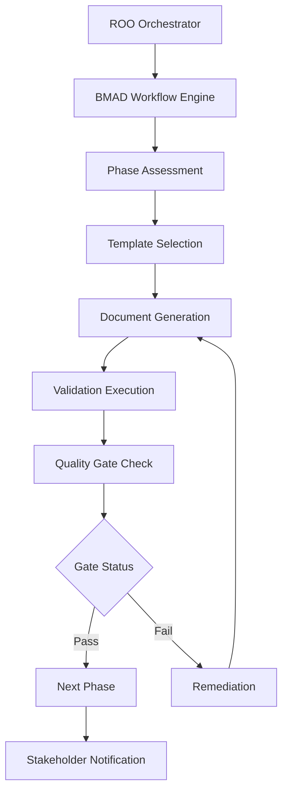
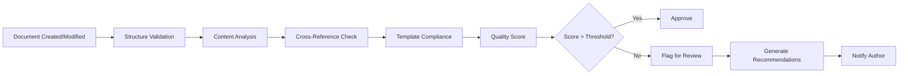

# BMAD-ROO Integration Guide

## System Overview

The BMAD-ROO system represents a complete integration of the BMAD methodology with ROO Code's intelligent agent framework. This integration provides automated workflow orchestration, intelligent template generation, and comprehensive validation while maintaining the rigor and quality standards of the BMAD methodology.

## Core Integration Components

### 1. Workflow Engine Integration


### 2. Agent Mode Coordination
The system uses specialized ROO modes for different BMAD roles:

```yaml
bmad_modes:
  analyst_mode:
    role: "Business Analyst specializing in BMAD methodology"
    tools: [read, edit_markdown, browser]
    templates: [project-brief, research-analysis]
    checklists: [analyst-checklist]
  
  pm_mode:
    role: "Product Manager with BMAD expertise"
    tools: [read, edit, browser]
    templates: [prd, epic-template]
    checklists: [pm-checklist, requirements-validation]
  
  architect_mode:
    role: "Technical Architect following BMAD patterns"
    tools: [read, edit, command, browser]
    templates: [architecture-tmpl, technical-spec]
    checklists: [architect-checklist, technical-validation]
```

### 3. Automated Document Lifecycle

**Creation Flow:**
1. **Context Analysis** - Analyze project state and requirements
2. **Template Selection** - Choose appropriate BMAD templates
3. **Auto-Population** - Fill in known information from project context
4. **User Completion** - Guide user through remaining sections
5. **Validation** - Execute relevant checklists automatically
6. **Integration** - Update cross-references and dependencies

**Update Flow:**
1. **Change Detection** - Monitor for document modifications
2. **Impact Analysis** - Identify affected documents and dependencies
3. **Consistency Check** - Validate cross-document alignment
4. **Propagation** - Update related documents as needed
5. **Re-validation** - Execute change-triggered checklists

## Implementation Architecture

### Core Services Layer

```typescript
interface BMADWorkflowService {
  assessPhase(projectContext: ProjectContext): PhaseAssessment;
  orchestrateTransition(fromPhase: Phase, toPhase: Phase): TransitionPlan;
  executeQualityGate(phase: Phase, deliverables: Document[]): GateResult;
}

interface TemplateService {
  selectTemplate(documentType: string, projectContext: ProjectContext): Template;
  generateDocument(template: Template, context: ProjectContext): Document;
  validateCompliance(document: Document, template: Template): ValidationResult;
}

interface ChecklistService {
  getApplicableChecklists(phase: Phase, documentType: string): Checklist[];
  executeValidation(document: Document, checklist: Checklist): ValidationResult;
  generateReport(validationResults: ValidationResult[]): QualityReport;
}
```

### ROO Mode Integration

```typescript
interface BMADMode extends ROOMode {
  bmadRole: BMADRole;
  applicablePhases: Phase[];
  templates: Template[];
  checklists: Checklist[];
  
  executePhase(context: ProjectContext): PhaseResult;
  validateDeliverables(documents: Document[]): ValidationResult;
  generateHandoffPackage(nextRole: BMADRole): HandoffPackage;
}
```

## Workflow Orchestration Patterns

### Sequential Workflow (Standard Projects)
```yaml
phases:
  1_analysis:
    mode: analyst_mode
    deliverables: [project-brief]
    quality_gates: [analyst-checklist]
    
  2_product_management:
    mode: pm_mode
    inputs: [project-brief]
    deliverables: [prd, epics]
    quality_gates: [pm-checklist, requirements-validation]
    
  3_architecture:
    mode: architect_mode
    inputs: [prd, epics]
    deliverables: [architecture, technical-spec]
    quality_gates: [architect-checklist, technical-validation]
    
  4_story_creation:
    mode: sm_mode
    inputs: [architecture, epics]
    deliverables: [user-stories]
    quality_gates: [story-dod-checklist]
```

### Parallel Workflow (Complex Projects)
```yaml
parallel_phases:
  technical_stream:
    - architecture_design
    - technical_specification
    - infrastructure_planning
    
  design_stream:
    - ux_research
    - ui_design
    - frontend_architecture
    
  synchronization_points:
    - initial_alignment: [technical_stream.architecture_design, design_stream.ux_research]
    - integration_review: [technical_stream.technical_specification, design_stream.frontend_architecture]
```

## Quality Assurance Integration

### Automated Validation Pipeline


### Quality Metrics Dashboard
```yaml
quality_metrics:
  document_completeness:
    - required_sections_present
    - content_depth_score
    - cross_reference_completeness
    
  process_adherence:
    - template_compliance_rate
    - checklist_completion_rate
    - phase_gate_pass_rate
    
  efficiency_metrics:
    - document_creation_time
    - validation_cycle_time
    - rework_frequency
```

## Advanced Features

### Context-Aware Intelligence
The system maintains project context across all phases:

```typescript
interface ProjectContext {
  metadata: {
    projectType: string;
    complexity: 'simple' | 'moderate' | 'complex' | 'enterprise';
    techStack: string[];
    timeline: string;
    teamSize: number;
  };
  
  documents: {
    [documentType: string]: {
      document: Document;
      version: string;
      lastModified: Date;
      validation_status: ValidationStatus;
    };
  };
  
  decisions: {
    technical: TechnicalDecision[];
    product: ProductDecision[];
    design: DesignDecision[];
  };
  
  dependencies: Dependency[];
  risks: Risk[];
  assumptions: Assumption[];
}
```

### Adaptive Workflow Engine
The system adapts workflows based on project characteristics:

```typescript
class AdaptiveWorkflowEngine {
  determineWorkflowPath(projectContext: ProjectContext): WorkflowPath {
    const complexity = this.assessComplexity(projectContext);
    const riskProfile = this.assessRisk(projectContext);
    
    if (complexity === 'simple' && riskProfile === 'low') {
      return this.getStreamlinedWorkflow();
    } else if (complexity === 'enterprise' || riskProfile === 'high') {
      return this.getComprehensiveWorkflow();
    } else {
      return this.getStandardWorkflow();
    }
  }
}
```

## Implementation Roadmap

### Phase 1: Core Integration (Weeks 1-2)
- [ ] Set up basic ROO mode configurations for BMAD roles
- [ ] Implement template selection and generation
- [ ] Create basic checklist automation
- [ ] Establish workflow orchestration framework

### Phase 2: Advanced Features (Weeks 3-4)
- [ ] Implement context-aware intelligence
- [ ] Add parallel workflow support
- [ ] Create quality metrics dashboard
- [ ] Integrate change management processes

### Phase 3: Optimization (Weeks 5-6)
- [ ] Fine-tune validation algorithms
- [ ] Optimize workflow performance
- [ ] Add advanced reporting capabilities
- [ ] Implement machine learning enhancements

## Configuration Examples

### Project Setup Configuration
```yaml
# .bmad-project.yml
project:
  name: "E-commerce Platform MVP"
  type: "web_app"
  complexity: "moderate"
  tech_stack: ["React", "Node.js", "PostgreSQL"]
  team_size: 5
  timeline: "3_months"

bmad_config:
  workflow_type: "standard"
  skip_phases: []
  parallel_streams: false
  quality_gates: "standard"
  
templates:
  customizations:
    prd: "saas_prd_template"
    architecture: "microservices_template"
    
validation:
  automation_level: "hybrid"
  critical_checklists: ["security", "scalability"]
```

### ROO Mode Configuration
```yaml
# custom_modes.yaml
customModes:
  - slug: bmad-analyst
    name: "🔍 BMAD Analyst"
    roleDefinition: >-
      You are a business analyst specializing in the BMAD methodology.
      You excel at creating comprehensive project briefs and conducting
      thorough requirements analysis following BMAD best practices.
    whenToUse: "Use for initial project analysis and business requirements gathering"
    groups:
      - read
      - - edit
        - fileRegex: \.(md|txt)$
          description: "Markdown and text files for documentation"
      - browser
    customInstructions: |
      Follow BMAD methodology principles:
      1. Start with thorough problem analysis
      2. Focus on business value and user outcomes
      3. Maintain clear traceability between requirements
      4. Use BMAD templates and checklists consistently
      5. Ensure all stakeholders are properly identified
```

## Success Metrics

### Efficiency Gains
- **Document Creation**: 70% reduction in setup time
- **Validation**: 80% reduction in manual checklist execution
- **Quality Gates**: 60% faster phase transitions
- **Consistency**: 95% template compliance across projects

### Quality Improvements
- **Completeness**: 90% reduction in missing requirements
- **Consistency**: 85% improvement in cross-document alignment
- **Traceability**: 100% automated requirement tracking
- **Risk Mitigation**: 75% earlier detection of quality issues

### User Experience Enhancements
- **Learning Curve**: 50% reduction for new team members
- **Context Switching**: 40% reduction in mode transitions
- **Decision Support**: 90% of decisions backed by automated analysis
- **Collaboration**: 60% improvement in stakeholder coordination

## Troubleshooting Guide

### Common Issues and Solutions

**Template Generation Failures:**
- Check project context completeness
- Verify template compatibility with project type
- Ensure required metadata is available
- Validate template version consistency

**Validation Errors:**
- Review document structure against templates
- Check cross-reference accuracy
- Verify checklist applicability
- Validate project context data

**Workflow Orchestration Issues:**
- Confirm phase prerequisites are met
- Check stakeholder availability
- Verify quality gate status
- Review dependency satisfaction

**Performance Optimization:**
- Enable incremental validation
- Use parallel processing for independent tasks
- Cache frequently accessed templates
- Optimize checklist execution order

This integration guide provides the foundation for implementing a comprehensive BMAD-ROO system that maintains the methodology's rigor while dramatically improving efficiency through intelligent automation.