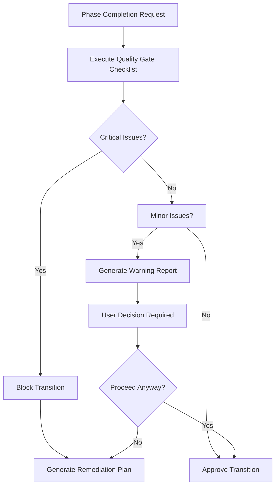

# Intelligent Checklist Automation Task

## Purpose

This task provides automated checklist execution, validation tracking, and quality assurance for BMAD deliverables. It intelligently selects appropriate checklists, executes validation procedures, and provides comprehensive reporting while maintaining the rigor of the BMAD methodology.

## Context

BMAD methodology relies heavily on systematic validation through comprehensive checklists. This task automates the execution and tracking of these validations while preserving the thoroughness and quality standards that make BMAD effective.

## Instructions

### 1. Checklist Selection and Mapping

**Automatic Checklist Assignment:**
```yaml
checklist_mapping:
  phases:
    analysis: [analyst-validation]
    product_management: [pm-checklist, requirements-validation]
    architecture: [architect-checklist, technical-validation]
    frontend_design: [frontend-architecture-checklist, ux-validation]
    story_creation: [story-dod-checklist, story-draft-checklist]
    validation: [po-master-checklist, change-checklist]
  
  triggers:
    document_created: validate_structure
    phase_complete: execute_quality_gate
    change_detected: run_change_checklist
    handoff_requested: validate_completeness
```

**Context-Aware Selection:**
- Analyze current project phase and deliverables
- Identify applicable checklists based on document types
- Consider project complexity and skip unnecessary validations
- Adapt checklist depth based on risk assessment

### 2. Automated Validation Engine

**Document Analysis:**
- Parse document structure and content automatically
- Extract key information for validation
- Cross-reference with project requirements
- Identify missing or incomplete sections

**Validation Algorithms:**
```python
def validate_document(document, checklist):
    results = {}
    
    for section in checklist.sections:
        for item in section.items:
            validation_result = execute_validation_rule(
                item.rule,
                document,
                project_context
            )
            results[item.id] = {
                'status': validation_result.status,  # PASS/FAIL/PARTIAL/N_A
                'evidence': validation_result.evidence,
                'confidence': validation_result.confidence,
                'recommendations': validation_result.recommendations
            }
    
    return generate_validation_report(results)
```

### 3. Intelligent Validation Rules

**Structure Validation:**
- Required sections presence check
- Section numbering and hierarchy validation
- Cross-reference accuracy verification
- Template compliance assessment

**Content Quality Assessment:**
- Completeness scoring based on section depth
- Consistency checking across documents
- Requirement coverage analysis
- Technical feasibility evaluation

**Cross-Document Validation:**
- Requirement traceability verification
- Architectural alignment checking
- Story-epic consistency validation
- Cross-functional requirement coverage

### 4. Evidence-Based Validation

**Evidence Collection:**
```yaml
evidence_types:
  explicit_mention:
    weight: 1.0
    description: "Direct statement addressing requirement"
  
  implicit_coverage:
    weight: 0.7
    description: "Requirement addressed indirectly"
  
  referenced_document:
    weight: 0.8
    description: "Requirement covered in linked document"
  
  partial_coverage:
    weight: 0.4
    description: "Some aspects covered, needs completion"
```

**Confidence Scoring:**
- High confidence (90-100%): Clear, explicit coverage
- Medium confidence (70-89%): Good coverage with minor gaps
- Low confidence (50-69%): Partial coverage, needs attention
- Very low confidence (<50%): Insufficient coverage, requires work

### 5. Interactive Validation Modes

**YOLO Mode (Fully Automated):**
- Execute all applicable checklists automatically
- Generate comprehensive validation reports
- Provide summary of critical issues
- Recommend next steps based on findings

**Interactive Mode (Guided Validation):**
- Present sections one at a time for review
- Allow user confirmation of automated findings
- Enable manual override of validation results
- Capture additional context and reasoning

**Hybrid Mode (Semi-Automated):**
- Automate clear pass/fail determinations
- Flag uncertain items for manual review
- Provide evidence and recommendations
- Allow selective user intervention

### 6. Advanced Validation Features

**Risk-Based Validation:**
```yaml
risk_assessment:
  high_risk_areas:
    - security_requirements
    - scalability_considerations
    - integration_dependencies
    - user_experience_critical_paths
  
  validation_depth:
    high_risk: comprehensive_validation
    medium_risk: standard_validation
    low_risk: basic_validation
```

**Contextual Adaptation:**
- Skip irrelevant checklist items based on project type
- Adjust validation criteria for different complexity levels
- Customize requirements based on industry standards
- Adapt to team size and experience levels

### 7. Quality Gate Management

**Phase Transition Gates:**


**Quality Metrics Tracking:**
- Validation completion rates
- Issue resolution time
- Rework frequency
- Quality trend analysis

### 8. Reporting and Analytics

**Validation Reports:**
```yaml
report_structure:
  executive_summary:
    - overall_status
    - critical_issues_count
    - recommendations_summary
    - approval_status
  
  detailed_findings:
    - section_by_section_results
    - evidence_collected
    - confidence_scores
    - specific_recommendations
  
  action_items:
    - priority_ranked_issues
    - responsible_parties
    - estimated_effort
    - dependencies
```

**Trend Analysis:**
- Quality improvement over time
- Common failure patterns
- Team performance metrics
- Process effectiveness measurement

### 9. Integration with BMAD Ecosystem

**Template Integration:**
- Validate documents against template requirements
- Check template compliance and formatting
- Ensure required sections are properly completed
- Verify template version compatibility

**Workflow Integration:**
- Trigger validations at appropriate workflow points
- Block phase transitions for critical failures
- Generate notifications for stakeholders
- Update project status based on validation results

**Knowledge Base Integration:**
- Reference BMAD best practices for validation
- Apply methodology-specific quality standards
- Incorporate lessons learned from previous projects
- Maintain consistency with BMAD principles

### 10. Checklist Customization and Evolution

**Dynamic Checklist Generation:**
- Create project-specific validation rules
- Adapt existing checklists for unique requirements
- Generate custom checklists for specialized domains
- Evolve checklists based on project learnings

**Continuous Improvement:**
- Track validation effectiveness metrics
- Identify frequently failing validation rules
- Suggest checklist improvements based on patterns
- Evolve validation criteria based on outcomes

## Validation Algorithms

### Content Analysis Engine
```python
def analyze_content_completeness(section, requirements):
    completeness_score = 0
    evidence_items = []
    
    for requirement in requirements:
        evidence = find_evidence_for_requirement(section, requirement)
        if evidence:
            evidence_items.append(evidence)
            completeness_score += calculate_requirement_score(evidence)
    
    return {
        'score': completeness_score / len(requirements),
        'evidence': evidence_items,
        'gaps': identify_gaps(requirements, evidence_items)
    }
```

### Cross-Reference Validation
```python
def validate_cross_references(document, project_documents):
    broken_references = []
    missing_references = []
    
    for reference in document.get_references():
        if not reference.target_exists(project_documents):
            broken_references.append(reference)
    
    for expected_ref in get_expected_references(document):
        if not expected_ref.exists_in(document):
            missing_references.append(expected_ref)
    
    return {
        'broken_references': broken_references,
        'missing_references': missing_references,
        'reference_completeness': calculate_reference_score()
    }
```

## Success Criteria

**Automation Efficiency:**
- Reduce manual checklist execution time by 80%
- Increase validation consistency across projects
- Accelerate quality gate processes
- Minimize human error in validation

**Quality Assurance:**
- Maintain or improve validation thoroughness
- Increase early detection of quality issues
- Reduce rework due to missed validation items
- Improve overall project quality metrics

**User Experience:**
- Provide clear, actionable validation feedback
- Reduce cognitive load on human validators
- Enable focus on high-value validation activities
- Streamline quality assurance workflows

## Error Handling

**Validation Failures:**
- Graceful degradation to manual validation
- Clear error reporting and troubleshooting
- Automatic retry mechanisms for transient issues
- Escalation procedures for critical failures

**Data Quality Issues:**
- Handle incomplete or malformed documents
- Provide meaningful error messages
- Suggest corrective actions
- Maintain validation integrity despite data issues

## Future Enhancements

**Machine Learning Integration:**
- Learn from validation patterns to improve accuracy
- Predict likely validation failures
- Suggest proactive quality improvements
- Evolve validation rules based on outcomes

**Advanced Analytics:**
- Predictive quality assessment
- Risk-based validation prioritization
- Performance benchmarking across projects
- Quality correlation analysis with project success