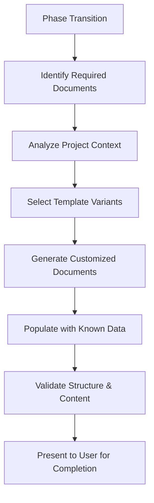
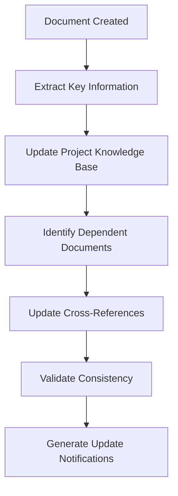

# Automated Template Generation Task

## Purpose

This task provides intelligent template selection, customization, and generation capabilities for BMAD deliverables. It automates the creation of properly structured documents with pre-populated sections, ensuring consistency and reducing manual setup time.

## Context

BMAD projects require multiple documents following specific templates and formats. This task intelligently selects appropriate templates based on project context, customizes them for specific needs, and generates properly structured documents with relevant pre-populated content.

## Instructions

### 1. Template Selection Logic

**Project Analysis:**
- Analyze project type, complexity, and requirements
- Identify required deliverables for current phase
- Assess stakeholder preferences and constraints
- Determine appropriate template variants

**Selection Criteria:**
```yaml
template_selection:
  project_type: web_app | mobile_app | api | desktop | embedded
  complexity: simple | moderate | complex | enterprise
  tech_stack: list_of_technologies
  industry: saas | ecommerce | fintech | healthcare | etc
  team_size: solo | small | medium | large
  timeline: sprint | quarter | semester | annual
```

### 2. Template Customization Engine

**Dynamic Customization:**
- Adapt sections based on project requirements
- Include/exclude optional sections intelligently
- Adjust detail levels for different audiences
- Incorporate project-specific terminology

**Context Integration:**
- Pull project data from existing documents
- Reference established patterns and decisions
- Maintain consistency with previous deliverables
- Integrate stakeholder preferences

### 3. Document Generation Workflows

**Core Document Types:**

#### Project Brief Generation
```yaml
project_brief:
  auto_populate:
    - project_name
    - stakeholder_list
    - initial_requirements
    - success_metrics
  customize_sections:
    - problem_statement
    - target_audience
    - competitive_landscape
    - constraints
```

#### PRD Generation
```yaml
prd:
  auto_populate:
    - project_context_from_brief
    - user_personas
    - feature_requirements
    - success_criteria
  customize_sections:
    - market_analysis
    - user_journeys
    - technical_considerations
    - mvp_scope
```

#### Architecture Document Generation
```yaml
architecture:
  auto_populate:
    - requirements_from_prd
    - technology_stack
    - system_components
    - deployment_strategy
  customize_sections:
    - technical_decisions
    - scalability_considerations
    - security_requirements
    - operational_concerns
```

#### Story Template Generation
```yaml
story:
  auto_populate:
    - epic_context
    - acceptance_criteria_framework
    - technical_context
    - dependency_references
  customize_sections:
    - implementation_guidance
    - testing_approach
    - definition_of_done
    - risk_considerations
```

### 4. Intelligent Content Population

**Data Sources:**
- Previous project documents
- Established technical preferences
- Industry best practices
- Team expertise profiles

**Population Strategies:**
- Extract relevant context from existing documents
- Generate placeholder content with clear instructions
- Include cross-references to related sections
- Provide guided prompts for manual completion

### 5. Template Validation and Compliance

**Structure Validation:**
- Verify all required sections are present
- Check section numbering and hierarchy
- Validate cross-references and links
- Ensure template version compatibility

**Content Quality Checks:**
- Identify missing critical information
- Flag inconsistencies with project context
- Suggest improvements based on best practices
- Validate against relevant checklists

### 6. Version Management

**Template Versioning:**
- Track template evolution and updates
- Manage backward compatibility
- Handle template migrations smoothly
- Maintain audit trails for changes

**Document Lifecycle:**
- Create new documents from latest templates
- Update existing documents to new template versions
- Archive superseded document versions
- Maintain provenance and change history

### 7. Specialized Template Variants

**Frontend Architecture Templates:**
- React/Vue/Angular specific sections
- Component specification templates
- State management documentation
- UI/UX integration guidelines

**Backend Architecture Templates:**
- API design documentation
- Database schema templates
- Microservices architecture
- Integration pattern documentation

**Full-Stack Templates:**
- End-to-end system documentation
- Cross-layer interaction patterns
- Deployment and operations
- Security implementation guides

## Template Generation Algorithms

### Context-Aware Generation
```python
def generate_document(template_type, project_context):
    # Analyze project requirements
    requirements = analyze_project_context(project_context)
    
    # Select optimal template variant
    template = select_template_variant(template_type, requirements)
    
    # Customize template structure
    customized_template = customize_template(template, requirements)
    
    # Populate with available data
    populated_document = populate_template(customized_template, project_context)
    
    # Validate and enhance
    validated_document = validate_and_enhance(populated_document)
    
    return validated_document
```

### Smart Section Selection
```python
def select_sections(base_template, project_requirements):
    required_sections = base_template.required_sections
    optional_sections = evaluate_optional_sections(
        base_template.optional_sections,
        project_requirements
    )
    
    return required_sections + optional_sections
```

### Content Enhancement
```python
def enhance_content(document, project_knowledge_base):
    for section in document.sections:
        if section.needs_enhancement:
            enhanced_content = generate_enhanced_content(
                section,
                project_knowledge_base
            )
            section.content = enhanced_content
    
    return document
```

## Integration Patterns

### Workflow Integration


### Cross-Document Consistency


## Quality Assurance Features

### Automated Validation
- Template structure compliance
- Required section completeness
- Cross-reference accuracy
- Formatting consistency

### Content Quality Metrics
- Information completeness scoring
- Consistency with project context
- Alignment with BMAD methodology
- Stakeholder requirement coverage

### Enhancement Suggestions
- Missing section identification
- Content improvement recommendations
- Best practice integration opportunities
- Template optimization suggestions

## Success Criteria

**Generation Efficiency:**
- Reduce document creation time by 70%
- Minimize manual template setup
- Accelerate project initialization
- Streamline document updates

**Quality Assurance:**
- 100% template compliance
- Consistent cross-document formatting
- Accurate cross-references and dependencies
- Reduced template-related errors

**User Experience:**
- Intuitive template selection process
- Clear guidance for document completion
- Minimal learning curve for new templates
- Flexible customization options

## Error Handling and Recovery

**Common Issues:**
- Template version mismatches
- Missing project context data
- Invalid customization parameters
- Content population failures

**Recovery Mechanisms:**
- Fallback to base templates
- Manual customization options
- Progressive content enhancement
- User-guided error resolution

## Future Enhancements

**AI-Powered Features:**
- Natural language template customization
- Intelligent content suggestion
- Automated quality assessment
- Smart template evolution

**Collaboration Features:**
- Multi-user template customization
- Collaborative content completion
- Template sharing and versioning
- Team-specific template variants