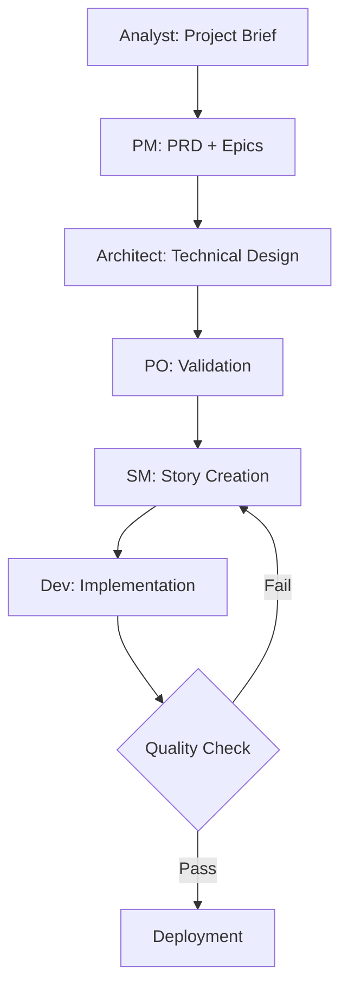
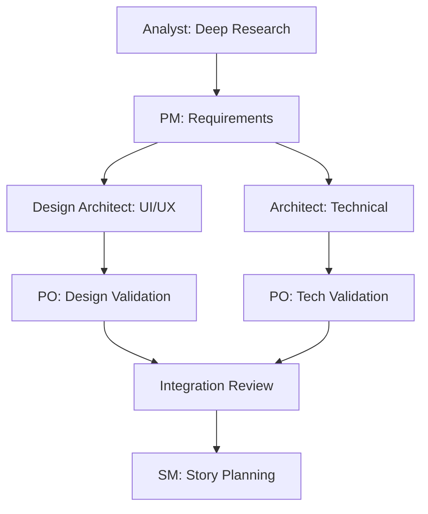
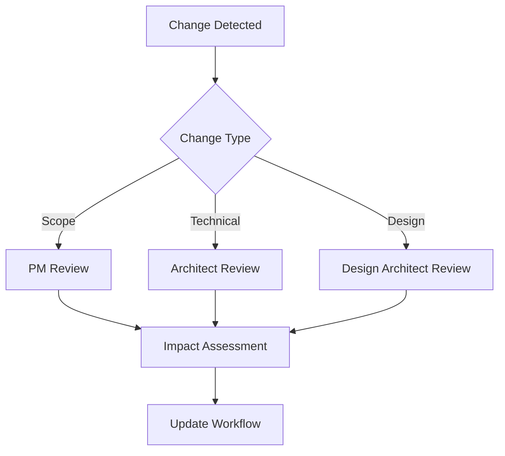

# Workflow Orchestration Task

## Purpose

This task provides advanced orchestration capabilities for managing complex BMAD workflows, handling phase transitions, and coordinating multiple workstreams. It serves as the primary automation engine for the BMAD-ROO system.

## Context

The BMAD Method involves multiple phases, roles, and deliverables that must be coordinated to ensure successful project execution. This task provides intelligent workflow management that adapts to project complexity and handles various scenarios including iterative refinement, parallel workstreams, and change management.

## Instructions

### 1. Workflow Assessment

**Initial Setup:**
- Analyze current project state and identify active workstreams
- Determine optimal workflow path based on project complexity
- Assess stakeholder availability and constraints
- Identify potential risks and mitigation strategies

**State Analysis:**
```yaml
workflow_state:
  current_phase: string
  active_documents: list
  pending_approvals: list
  blockers: list
  parallel_streams: list
```

### 2. Phase Orchestration

**Sequential Flow Management:**
1. **Phase Prerequisites Check**
   - Verify all required inputs are available
   - Validate previous phase deliverables
   - Confirm stakeholder approvals
   - Check resource availability

2. **Phase Transition Protocol**
   - Execute appropriate handoff procedures
   - Transfer context and artifacts
   - Update canonical state files
   - Archive superseded documents

3. **Quality Gate Validation**
   - Run relevant checklists automatically
   - Validate cross-document consistency
   - Check template compliance
   - Verify success criteria

### 3. Parallel Workstream Coordination

**Multi-Stream Management:**
- Coordinate UI/UX design with technical architecture
- Manage PM and Architect parallel activities
- Synchronize dependent deliverables
- Handle merge conflicts and integration points

**Dependency Tracking:**
```yaml
dependencies:
  - source_deliverable: string
    target_deliverable: string
    relationship_type: string  # blocks, informs, validates
    status: string  # satisfied, pending, blocked
```

### 4. Adaptive Workflow Patterns

**Simple Projects (Skip Phases):**
- Direct Analyst → PM → Developer flow
- Minimal documentation requirements
- Streamlined approval processes
- Accelerated delivery cycles

**Complex Projects (Full Workflow):**
- Complete phase sequence with all role validations
- Comprehensive documentation and review cycles
- Multiple iteration loops
- Extensive stakeholder coordination

**Agile Integration:**
- Sprint planning integration
- Story refinement automation
- Backlog prioritization support
- Velocity tracking and adjustment

### 5. Change Management Integration

**Change Detection:**
- Monitor for scope changes during execution
- Identify technical blockers and pivots
- Track requirement evolution and impact
- Detect quality issues requiring rework

**Change Response Protocols:**
- Trigger appropriate change checklists
- Coordinate stakeholder communication
- Manage document versioning and updates
- Execute rollback procedures when needed

### 6. Automation Capabilities

**Document Generation:**
- Auto-create documents from templates
- Populate standard sections with project data
- Generate cross-references and dependencies
- Maintain document relationships

**Checklist Automation:**
- Execute checklists based on triggers
- Track completion status across phases
- Generate validation reports
- Escalate critical issues

**Status Reporting:**
- Generate project dashboards
- Track milestone completion
- Monitor quality metrics
- Provide stakeholder updates

### 7. Integration Points

**Template System Integration:**
- Select appropriate templates for deliverables
- Customize templates based on project type
- Ensure template version consistency
- Validate template compliance

**Checklist System Integration:**
- Map checklists to workflow phases
- Execute validation procedures
- Track checklist completion
- Generate compliance reports

**Knowledge Base Integration:**
- Reference BMAD best practices
- Apply methodology guidelines
- Provide contextual guidance
- Suggest process improvements

## Workflow Scenarios

### Scenario 1: Standard MVP Development


### Scenario 2: Complex Product Development


### Scenario 3: Change Management


## Success Criteria

**Workflow Completion:**
- All required deliverables are produced
- Quality gates are satisfied
- Stakeholder approvals are obtained
- Documentation is complete and consistent

**Process Efficiency:**
- Minimal rework and iteration cycles
- Optimal resource utilization
- Reduced coordination overhead
- Accelerated delivery timelines

**Quality Assurance:**
- Template compliance across all documents
- Checklist completion for all phases
- Cross-document consistency validation
- Stakeholder satisfaction with deliverables

## Error Handling

**Common Issues:**
- Missing prerequisites for phase transition
- Stakeholder unavailability or approval delays
- Quality gate failures requiring rework
- Resource conflicts or capacity constraints

**Recovery Procedures:**
- Automatic rollback to stable states
- Alternative workflow path selection
- Escalation procedures for blockers
- Emergency bypass protocols for critical issues

## Integration with ROO System

**Mode Coordination:**
- Automatic mode switching based on workflow phase
- Context preservation across mode transitions
- Intelligent mode selection for specific tasks
- Custom mode activation for specialized workflows

**Template Integration:**
- Dynamic template selection and customization
- Automatic document creation and population
- Template versioning and update management
- Compliance validation and reporting

**Checklist Integration:**
- Automated checklist execution and tracking
- Real-time validation and feedback
- Exception handling and escalation
- Comprehensive audit trails and reporting